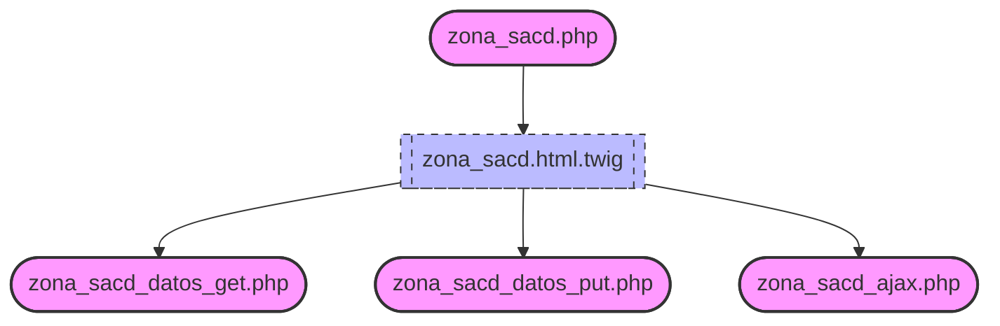

```mermaid
flowchart TD
    %% Estils de nodes
    classDef controller fill:#f9f,stroke:#333,stroke-width:2px;
    classDef vista fill:#bbf,stroke:#333,stroke-width:1px,stroke-dasharray: 5 5;
    classDef error fill:#ff9999,stroke:#cc0000,stroke-width:2px;

    apps_zonassacd_controller_zona_sacd_php(["zona_sacd.php"]):::controller --> apps_zonassacd_view_zona_sacd_html_twig[["zona_sacd.html.twig"]]:::vista
    apps_zonassacd_view_zona_sacd_html_twig --> apps_misas_controller_zona_sacd_datos_get_php(["zona_sacd_datos_get.php"]):::controller
    apps_zonassacd_view_zona_sacd_html_twig --> apps_misas_controller_zona_sacd_datos_put_php(["zona_sacd_datos_put.php"]):::controller
    %% DESTÍ NO RESOLT des de apps_zonassacd_view_zona_sacd_html_twig: {{ oHash }} [DESTÍ NO RESOLT]
    apps_zonassacd_view_zona_sacd_html_twig --> apps_zonassacd_controller_zona_sacd_ajax_php(["zona_sacd_ajax.php"]):::controller
```